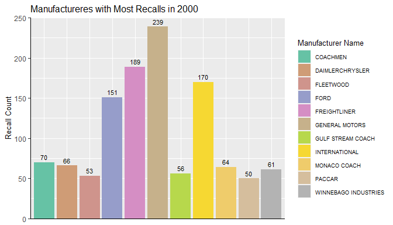

<!-- README.md is generated from README.Rmd. Please edit that file -->

# caRecall

<!-- badges: start -->

[](https://github.com/WraySmith/caRecall/actions)
[](https://codecov.io/gh/WraySmith/caRecall?branch=main)
<!-- badges: end -->

The `caRecall` package is an API wrapper for the Government of Canada
[Vehicle Recalls Database
(VRD)](https://tc.api.canada.ca/en/detail?api=VRDB) used by the Defect
Investigations and Recalls Division for vehicles, tires, and child car
seats. The API wrapper provides access to recall summary information
searchable by make, model, and year range, as well as detailed recall
information searchable by recall number.

The package focuses on querying data from the VRD API to return the
following:

-   Recall summary information
-   Recall counts
-   Detailed recall information

## Installation

The development version of the `caRecall` package can be installed from
[GitHub](https://github.com/) with:

``` r
# install.packages("devtools")
devtools::install_github("WraySmith/caRecall")
```

## Usage

More documentation on `caRecall` can found at:
<https://wraysmith.github.io/caRecall/>

Note that an API key is required to run the functions in `caRecall` and
query the Vehicle Recalls Database. The key can be acquired at
<https://tc.api.canada.ca/en/detail?api=VRDB>.

A simple example of using the `recall_by_years()` function in the
package to return all recalls manufactured in 2000 could be done as
follows:

``` r
recall_summary_2000 <- recall_by_years(start_year = 2000, end_year = 2000, limit = 3000)
recall_summary_2000
#> # A tibble: 2,422 x 6
#>    `Recall number` `Manufacturer N~ `Model name` `Make name`  Year `Recall date`
#>    <chr>           <chr>            <chr>        <chr>       <int> <date>       
#>  1 1993076         MERCEDES-BENZ    300          MERCEDES-B~  2000 1993-05-31   
#>  2 1999056         FIAT CHRYSLER A~ NEON         CHRYSLER     2000 1999-04-14   
#>  3 1999108         FIAT CHRYSLER A~ NEON         CHRYSLER     2000 1999-06-07   
#>  4 1999111         FLEETWOOD        TIOGA        FLEETWOOD    2000 1999-06-08   
#>  5 1999137         POLARIS          SNOWMOBILE   POLARIS      2000 1999-07-26   
#>  6 1999138         MAZDA            MPV          MAZDA        2000 1999-07-27   
#>  7 1999147         MAZDA            MPV          MAZDA        2000 1999-07-30   
#>  8 1999151         GENERAL MOTORS   S10          CHEVROLET    2000 1999-08-16   
#>  9 1999151         GENERAL MOTORS   SONOMA       GMC          2000 1999-08-16   
#> 10 1999155         GENERAL MOTORS   SUNFIRE      PONTIAC      2000 1999-08-19   
#> # ... with 2,412 more rows
```

The data could then be used to summarize manufacturers with the highest
recall counts in the year:



Additionally, detailed recall information can be queried from the API
using the `recall_details()` function:

``` r
recall_windstar <- recall_details(1997118)
tibble(t(recall_windstar)) #transpose for readability here
#> # A tibble: 15 x 1
#>    `t(recall_windstar)`[,1]                                                     
#>    <chr>                                                                        
#>  1 "1997118"                                                                    
#>  2 "97S69"                                                                      
#>  3 "Light Truck & Van"                                                          
#>  4 "Camionnette et fourgonnette"                                                
#>  5 "WINDSTAR"                                                                   
#>  6 "FORD"                                                                       
#>  7 "27"                                                                         
#>  8 "Seats And Restraints"                                                       
#>  9 "Sièges et dispositifs de retenue"                                           
#> 10 "Safety Mfr"                                                                 
#> 11 "Sécurité - fabricant"                                                       
#> 12 "NOTE: VEHICLES EQUIPPED WITH SECOND ROW BENCH SEATS AND INTEGRATED CHILD SE~
#> 13 "NOTA : Vise les véhicules équipés d’une seconde banquette et du siège intég~
#> 14 "1998"                                                                       
#> 15 "1997-06-16"
```

## Getting Help or Reporting an Issue

To report bugs/issues/feature requests, please file an
[issue](https://github.com/WraySmith/caRecall/issues).

These are very welcome!

## How to Contribute

If you would like to contribute to the package, please see our
[CONTRIBUTING](https://github.com/WraySmith/caRecall/blob/main/CONTRIBUTING.md)
guidelines.

Please note that this project is released with a [Contributor Code of
Conduct](https://github.com/WraySmith/caRecall/blob/main/CODE_OF_CONDUCT.md).
By participating in this project you agree to abide by its terms.
